# Automated Birthday Emailer
### !!! IMPORTANT NOTE: IF YOU ADD YOUR GMAIL PASSWORD TO THIS PROJECT SET YOUR REPO TO PRIVATE !!!
Rewritten by Paul Berger.  Original Code from "100 Days of Code: The Complete Python Pro Bootcamp" by Dr. Angela Yu Day 32 
* Link to course: https://www.udemy.com/course/100-days-of-code/?kw=100+days+of+code&src=sac  

### Major Changes
* *passwd.py added rather than keeping Google Password in main.py*
* *Original project did not have automation,  would only work when run*
* *Added functionality to read in the entire letter_templates directory rather than manually typing out every line*
* *Added funtionality to replace the User's name in the letter templates*

### Creating and pushing code to a private Github Repository
**!!! If you are forking this code from my repo, make sure to save it and upload it to a new repository so that you can make it Private. At this time, there is no option to make a fork Private!!!    
There is sensitive information in this project including your personal gmail account name and the special password you created.  Because of this, we want to make sure that the repository is set to private.  While it is unlikely that anyone will be finding our repositories and taking our information, it is not impossible.  You never know who has web scrapers looking all over the place for information like this.  It is better to be safe than sorry! Setting the repository to private means that only the owner and anyone they set as a contributor can see the it**
1. Navigate to your github page and go to your Repositories.  Once there, click 'New' in the top right.   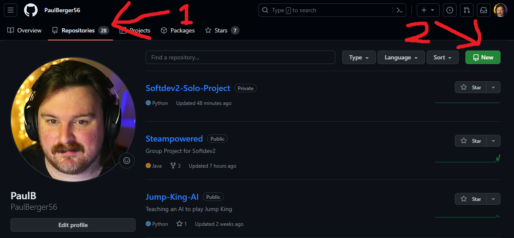   
2. Name your Repository something relevant and add a Description if you would like.  Just under Description, make sure the Satellite button next to 'Private' is Selected.  Make sure that the checkbox next to 'Add a README file' is UNCHECKED!!!!  There will be a conflict between this readme and the one you made if you leave that box checked.   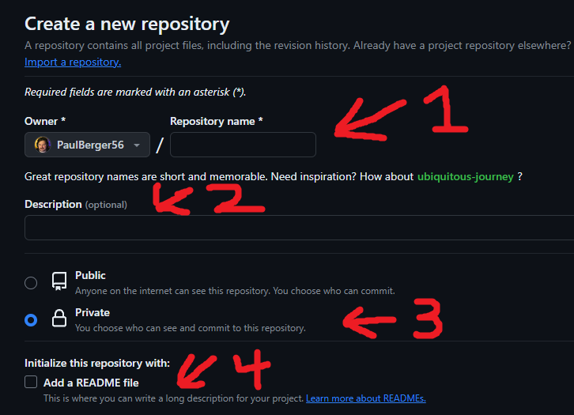   
3. Scroll down to the bottom of the page and click the 'Create repository' button.   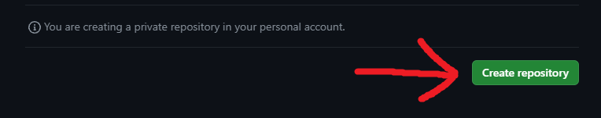   
4. Now you will be brought to the homepage of the new repository, but it will be completely empty.  Scroll down to the 'Quick setup' section and look for '...or push an existing repository from the command line'.  Click on the little boxes in the top right of the code just below it to copy the contents, or highlight the contents and press copy.      
5. Open your project in VSCode and make sure 'Birthday Wisher is the Root folder'.  Click on 'Terminal' at the top of the page and in the dropdown click 'New Terminal'.  If you would prefer to open a git bash in the root folder of the project in your file explorer, that is fine too.   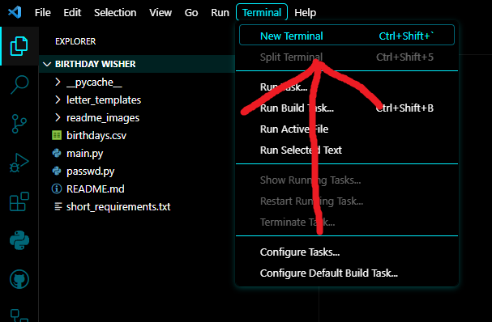   
6. In the terminal, or in your git bash, type "git init" without the quotation marks and press enter.
7. Once the local repository is initialized you need to add and commit the local code before being able to push.
    * Type "git add ." without the quotation marks and press enter
    * Type "git commit -m 'Initial Commit' " without the quotation marks and press enter.
8. Paste the commands you copied from the '...or push an existing repository from the command line' section and press enter. 
**!!!It is assumed that you have all of your credentials set up already.  If they are not, you may have to temporarily revert the repository back to public, remove any passwords or email addresses from your code, push the code to the repository, and set the repository back to private. Then return any passwords and email adresses to the code. If this is the case, I recommend completing all other steps up through testing that the code works before pushing to the repo.!!!**   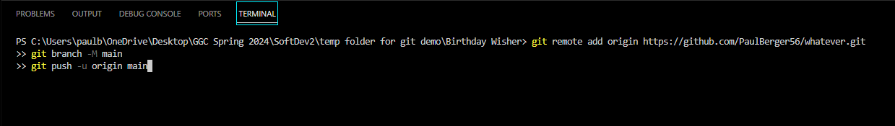   
9. Go back to your github repository's homepage and refresh.  If everything went well, you should see your code here.   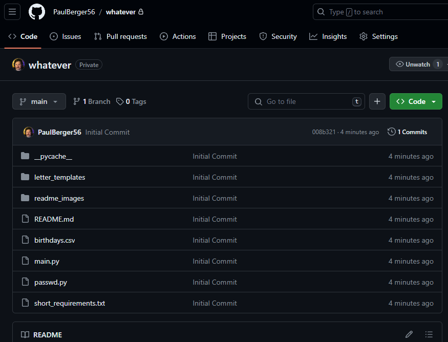   

### Getting Started
**These instructions assume that you already have python installed on your machine and are using VSCode as your IDE.**
 **!!! Notice: If the instructions below on running the code in a virtual environment gives you issues, just switch back to whichever environment runs the code for you.  This section is to make a later step easier, but may cause more problems than solutions You will still need to install any missing dependencies!!!** 

1. When prompted, run the python code in a Python Virtual Environment.  This will make managing dependencies with pip freeze easier later on.
    - If you are not prompted to create a virtual environment, you can do it manually. 
    - In the bottom right of the VSCode screen, you will see an area that says "Python", click on the text just to the right of that.         
    - This will bring up options at the top of the screen.  Click on "Create Virtual Environment"     
    - Click on Venv -> Delete and Recreate -> Pick your Python Version -> leave requirements.txt unchecked if the option pops up.
2. If you try to run the code, you will get an error that pandas is not installed.      
    - To rectify this, we need to install pandas from the command line.
    - In the open terminal type "pip install pandas" and press enter.
    - Try running the code again.  If no errors pop up, you have all of the dependencies installed.  If you get a message about another missing dependency, do the same thing as the previous step, but replace pandas with the name of the missing dependency.

### Changing Values in main.py
**The way this code is set up, we will be using a gmail account to send the emails.  There are ways to set this up for other types of email addresses, but for now we are sticking with gmail. If you would like to use a different email provider, you can look up what Mail Protocol they use and change line 59 accordingly.**

1. On line 5, replace [Your Name Here] with the name you would like to go by in your outgoing emails.  For example, my first name is Paul, so I would change '[Your Name Here]' to 'Paul'. ex: user_name = 'Paul'       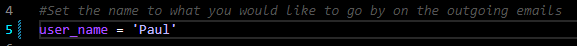   
2. On line 61 and 62, replace [Your Email Here] with your gmail adress that you would like the emails to be sent from.  For example if my email address was test@gmail.com, I would change '[Your Email Here]' to 'test@gmail.com'. ex: user='test@gmail.com'       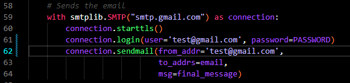   

### Adding Recipients to birthdays.csv
* The format of the csv file is name,email,month,day
* Do not remove the header from this file. The first line needs to say name,email,month,day
* You can add as many recipients as you want to this file.
* Make sure there is only One recipient per line, and no spaces in between the values, only commas.
* It is okay to have spaces in the Name ex. 'Sue Ann'
* The email adress for the recipients can be from any working email provider.  Only the outgoing email adress from the previous step needs to be gmail in this example.      

### Adding more letter templates
**You can add as many letter templates as you want in this project.  If the code detects a birthday, one will be chosen randomly and sent to the recipient.**
* The files must be in the .txt format.   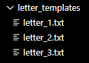   
* For the code to add your name as the sender, and the recipients name properly, you must use the proper format. 
    * Use the token [NAME] for the recipient's name.
    * Use the token [USER] for the sender's name.
       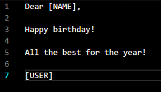   
* If done correctly, lines 45 to 48 in main.py will replace them with the proper names.    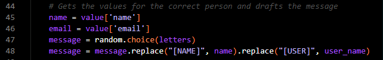   

### Creating and retrieving a password from Google
**Google creates special passwords to be able to send emails from your code rather than directly from your gmail page.  If you are using a different email service, you will have to look up how to do this part with their available services.  We will copy the password that is generated and put it in our passwd.py file.**
1. Go to google.com and click your profile picture in the top right and in the dropdown box click 'Manage your Google Account'.      
2. On the left side of the Screen, click Security.      
3. Scroll down to the Section labeled 'How you sign in to Google' and click on 2-Step Verification.      
4. If prompted to enter your password, go ahead and do so. Once on the 2-Step Verification Page, scroll all the way down to the section Labeled 'App Passwords' and click on the little arrow on the right side of the box.      
5. Once on the App passwords page, type a relevant name that pertains to this project in the App name text box and click create. Try to be specific with this name so you remember what project the password goes with.      
6. __IMPORTANT!!! DO NOT SHARE THIS PASSWORD WITH ANYONE. MAKE SURE YOUR REPOSITORY IS SET TO PRIVATE BEFORE PUSHING THE CODE TO IT WITH THIS PASSWORD IN IT!!!__
A pop up box will appear with your password showing.  It would be a good idea to save this password in a txt file or some other file locally, but outside of your project.  Once you leave this pop up window, you will not be able to access the code again.  If you lose it, you will have to create a new one and use that.      
7. Copy this code and open passwd.py. Once there, replace [Your password here] with the password you just copied.  For example, I would change PASSWORD = "[Your password here]" to PASSWORD = "111 awsdgt 33asda". FYI this is a fake example.      

### Testing the code
**Now that we have done all the steps to set up the code with our email, it is time to test it to make sure it works.  We will do this by sending an email to ourselves using the current date.**
1. Go into the birthdays.csv file and create a new entry with whatever name you want, an email address that you have access to, and the current date.   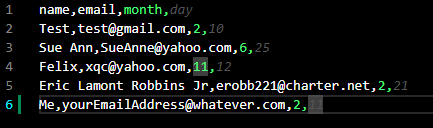   
2. Go to your browser and open the inbox of the email address that you put in the birthdays.csv file with the current date.  If everything is set up properly, you will see an email created from one of the letter templates with the proper names included.     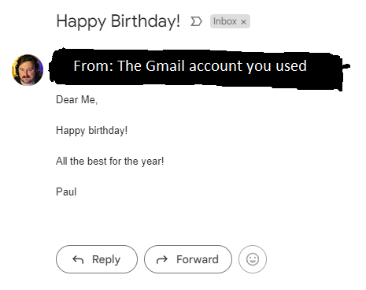   
3. If you recieved your email, everything is set up properly and you are ready to move on to automating the process.  If you did not recieve the email, first check to make sure that it did not end up in a spam folder.  If you still do not see it anywhere, go back through the steps and make sure you have everything formatted correctly and are using the same gmail account that you set up the special password for.

### Starting the Automation Process
**Asuming that that previous steps went well, and you recieved the email from yourself you are ready to move onto the autmation process.  For this, we are going to use a feature that is built into github called github actions.  It is free up to a certain threshold per month, but if this is the only program you are running, and assuming you set things up correctly, you will remain in the free tier.  To make sure the recipients see the email on their actual Birthday, we will schedule it to run early in the morning.**
1. If you have not pushed the changed code to your repository, go ahead and do so now.
2. Navigate to your repository's homepage and click on 'Actions' in the top bar. Once on the Actions page, click on 'set up a workflow yourself'.  Just below, github has a lot of premade actions, but in this case we are going to make our own.   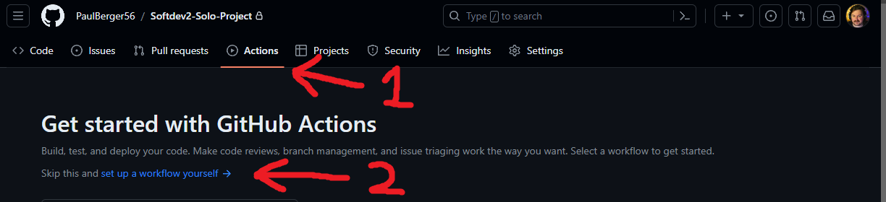   
3. As you can see, this will create a new file structure that we will need to automate our code.  This page will also have a large empty text field which is an empty main.yml file.  The .yml file is where we put the commands to let github know how and when to run our code. You can either edit the code here, but I recommend pressing 'Commit changes' in the top right and pulling this file and file structure to your local repository and editing it in your IDE. To do this, either in the terminal in your IDE, or your git bash shell, type "git pull" without the quotation marks and press enter.   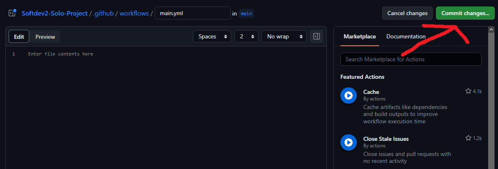   
4. In your IDE you will see the new directories .github\workflows with the main.yml file there.  Go ahead and open main.yml.  If it is giving you an error, that is okay.  It is most likely just because the file is currently empty.   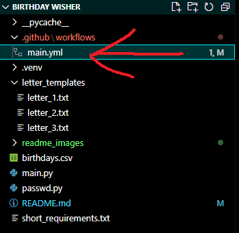   
5. For now I am going to give you the code for this in the actions.txt file, but explain what each part does. Go ahead and copy the contents from actions.txt into main.yml.  Feel free to delete actions.txt once this step is complete.
