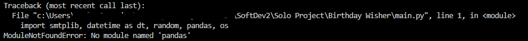

# Automated Birthday Emailer
### !!! IMPORTANT NOTE: IF YOU ADD YOUR GMAIL PASSWORD TO THIS PROJECT SET YOUR REPO TO PRIVATE !!!
Rewritten by Paul Berger.  Original Code from "100 Days of Code: The Complete Python Pro Bootcamp" by Dr. Angela Yu Day 32 
* Link to course: https://www.udemy.com/course/100-days-of-code/?kw=100+days+of+code&src=sac  

### Major Changes
* *passwd.py added rather than keeping Google Password in main.py*
* *Original project did not have automation,  would only work when run*
* *Added functionality to read in the entire letter_templates directory rather than manually typing out every line*
* *Added funtionality to replace the User's name in the letter templates*

### Getting Started
**These instructions assume that you already have python installed on your machine and are using VSCode as your IDE.**
 Notice: If instructions below on running the code in a virtual environment gives you issues, just switch back to whichever environment runs the code for you.  This section is to make a later step easier, but may cause more problems than solutions. 

1. When prompted, run the python code in a Python Virtual Environment.  This will make managing dependencies with pip freeze easier later on.
    - If you are not prompted to create a virtual environment, you can do it manually. 
    - In the bottom right of the VSCode screen, you will see an area that says "Python", click on the text just to the right of that.         
    - This will bring up options at the top of the screen.  Click on "Create Virtual Environment"     
    - Click on Venv -> Delete and Recreate -> Pick your Python Version -> leave requirements.txt unchecked if the option pops up.
2. If you try to run the code, you will get an error that pandas is not installed.      
    - To rectify this, we need to install pandas from the command line.
    - In the open terminal type "pip install pandas" and press enter.
    - Try running the code again.  If no errors pop up, you have all of the dependencies installed.  If you get a message about another missing dependency, do the same thing as the previous step, but replace pandas with the name of the missing dependency.

### Changing Values in main.py
**The way this code is set up, we will be using a gmail account to send the emails.  There are ways to set this up for other types of email addresses, but for now we are sticking with gmail. If you would like to use a different email provider, you can look up what Mail Protocol they use and change line 59 accordingly.**

1. On line 5, replace [Your Name Here] with the name you would like to go by in your outgoing emails.  For example, my first name is Paul, so I would change '[Your Name Here]' to 'Paul'.      
2. On line 61 and 62, replace [Your Email Here] with your gmail adress that you would like the emails to be sent from.  For example if my email address was test@gmail.com, I would change '[Your Email Here]' to 'test@gmail.com'.      

### Adding Recipients to birthdays.csv
* The format of the csv file is name,email,month,day
* Do not remove the header from this file. The first line needs to say name,email,month,day
* You can add as many recipients as you want to this file.
* Make sure there is only One recipient per line, and no spaces in between the values, only commas.
* It is okay to have spaces in the Name ex. 'Sue Ann'
* The email adress for the recipients can be any working email provider.  Only the outgoing email adress from the previous step needs to be gmail in this example.      

### Creating and retrieving a password from Google
**Google creates special passwords to be able to send emails from your code rather than directly from your gmail page.  If you are using a different email service, you will have to look up how to do this part with their available services.  We will copy the password that is generated and put it in our passwd.py file.**
1. Go to google.com and click your profile picture in the top right and in the dropdown box click 'Manage your Google Account'.      
2. On the left side of the Screen, click Security.      
3. Scroll down to the Section labeled 'How you sign in to Google' and click on 2-Step Verification.      
4. If prompted to enter your password, go ahead and do so. Once on the 2-Step Verification Page, scroll all the way down to the section Labeled 'App Passwords' and click on the little arrow on the right side of the box.      
5. Once on the App passwords page, type a relevant name that pertains to this project in the App name text box and click create. Try to be specific with this name so you remember what project the password goes with.      
6. __IMPORTANT!!! DO NOT SHARE THIS PASSWORD WITH ANYONE. MAKE SURE YOUR REPOSITORY IS SET TO PRIVATE BEFORE PUSHING THE CODE TO IT WITH THIS PASSWORD IN IT!!!__
A pop up box will appear with your password showing.  It would be a good idea to save this password in a txt file or some other file locally, but outside of your project.  Once you leave this pop up window, you will not be able to access the code again.  If you lose it, you will have to create a new one and use that.      
7. Copy this code and open passwd.py. Once there, replace [Your password here] with the password you just copied.  For example, I would change PASSWORD = "[Your password here]" to PASSWORD = "111 awsdgt 33asda". FYI this is a fake example.      